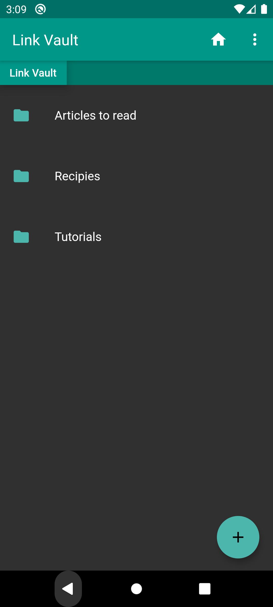
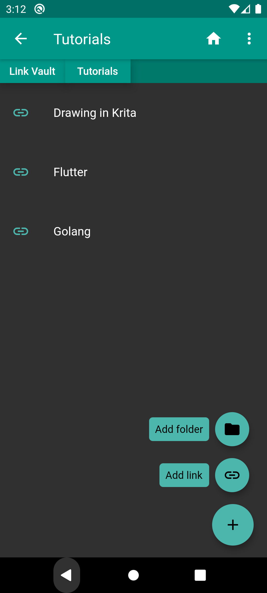
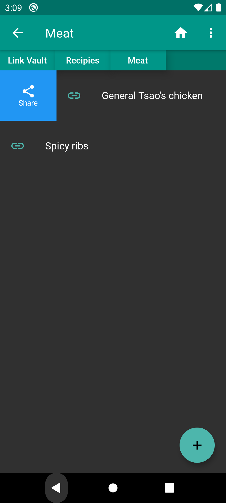
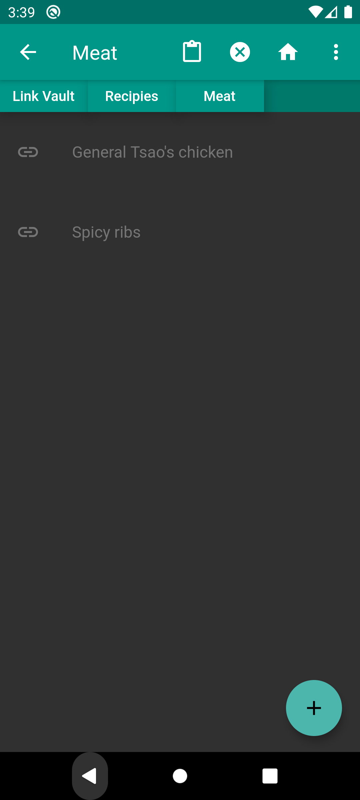
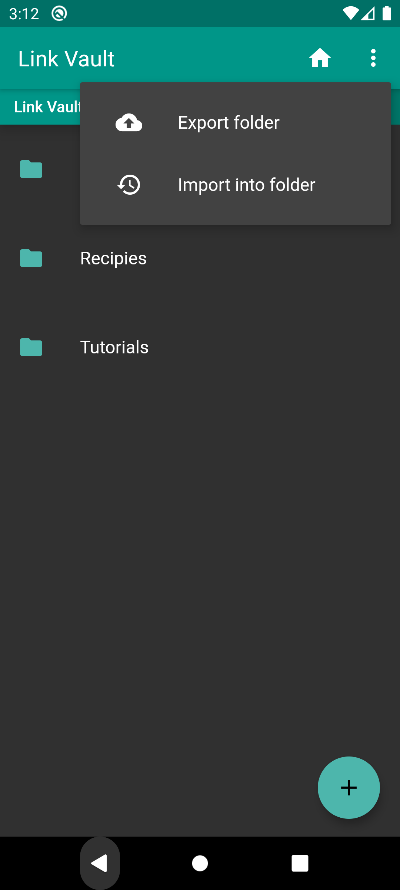

# LinkVault

LinkVault is an android app to keep all your handy links in one place. You can store recipies, tutorials, articles to read or anything you want.

# Installation

Just copy the LinkVault.apk to your android phone and istall.

# Usage

1. Adding items:

    Tap the + button to create one of two types of items:
    - Folders, used for grouping all your links. You can nest them however you like.
    - Links, which are named urls.

2. Navigating:
    
    To open a folder just tap it. You will see the current path above the list. The path bar is scrollable and by tapping any of its tabs you can quickly return to a corresponding folder.

3. Using items:

    - To open a link in a browser just tap it.
    
    - To share a link outside swipe right and tap the button.

    - To edit/delete link or folder swipe left and select an option.

4. Moving items:

    - Long press and item to mark it for moving. You can have multiple item selected at the same time. Two icons will appear on the app bar: "move" and "cancel". Cancel will unselect all the items.
    - Navigate to a folder you wat to place selected items in and tap the move button to confirm.

5. Exporting and importing

    - Tap the three dots button on the right of the app bar to show the menu.

    - To export the links from current folder tap "Export folder" and confirm the location to save a .json file.

    - To import previously saved links navigate to a folder you want to place them in and select "Import into folder".

    This way you can share your link collections with anyone. Just send them the .json file, and they can import it's content to any folder they like.

# Screenshots

